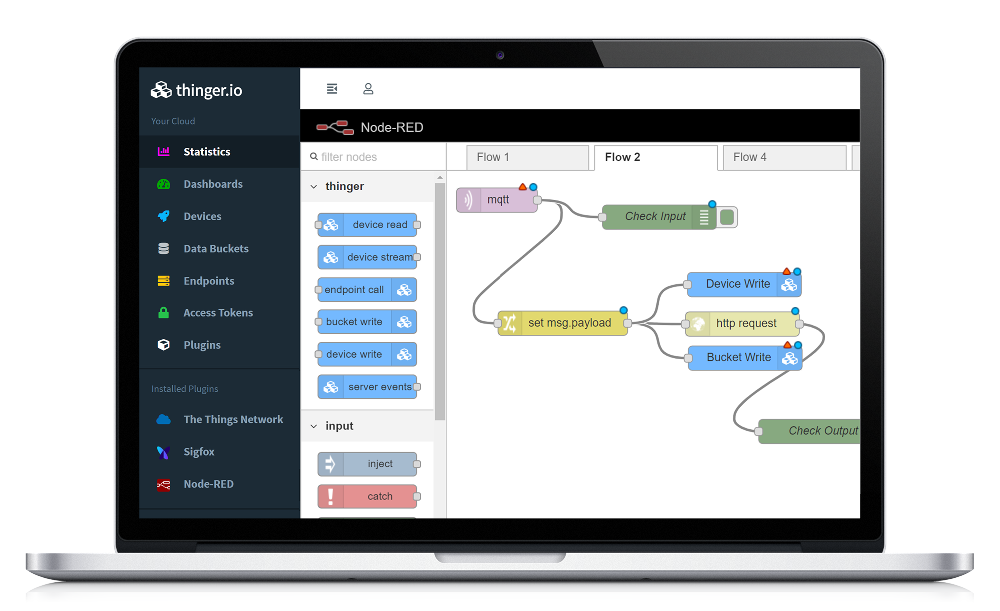

# node-red-contrib-thinger

Nodes to assist with the integration, automation and communication of [Node-RED](https://nodered.org/) and IoT devices with [Thinger.io](https://thinger.io/)

## Getting Started

Documentation regarding the module and nodes can be found [here](https://docs.thinger.io/plugins/node-red).

### Prerequisites

#### Cloud
Have a valid [Thinger.io](https://thinger.io/) cloud [instance](https://pricing.thinger.io/#!/cloud) with capacity to install a new plugin.

#### Local
Have a local instance of [Node-RED](https://nodered.org/) with the following characteristics:
- [Node.js](https://nodejs.org) - v12.0 or newer
- [Node-RED](https://NodeRED.org) - v1.X.X

### Installation

#### Cloud
To install the plugin on the [Thinger.io](https://thinger.io) instance follow the instructions from the [documentation](https://docs.thinger.io/plugins).

#### Local

To install the stable version use the `Menu - Manage palette - Install` 
option and search for `node-red-contrib-thinger`, or run the following 
command in your Node-RED user directory:

    npm install node-red-contrib-thinger

To connect the [Node-RED](https://NodeRED.org) instance to [Thinger.io](https://thinger.io) follow the instructions from [here](https://docs.thinger.io/plugins/node-red#starting-with-thinger-io-nodes).

## Nodes
Once installed, detailed documentation of each node can be found in the `Help` dialog of [Node-RED](https://NodeRED.org).
Below is a brief description of the actions allowed:
- Create buckets when an event occurs (bucket create node).
- Read from data buckets (bucket read node).
- Writing to data buckets (bucket write node).
- Calling devices callbacks with autoprovisioning (device callback node).
- Creating any type of devices (device create node).
- Reading a device resource when an event occurs (device read node).
- Subscribing to device resources at a given interval (device stream node).
- Sending data to a connected device (device write node).
- Calling endpoints (endpoint call node).
- Reading properties of devices, types or groups (property read node).
- Writing and modifying properties of devices, types or groups (property write node).
- Detecting different events of devices, buckets and endpoints (server events node).
